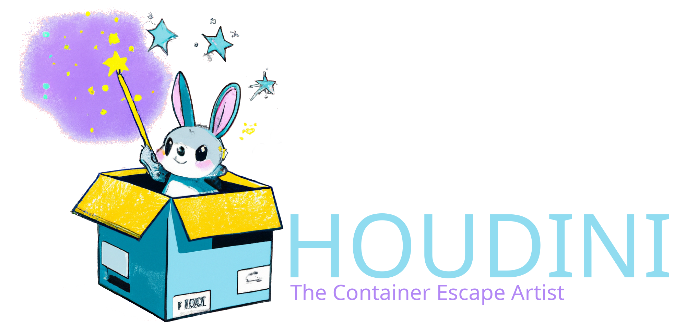

Houdini is a container escape artist.

## License

This software is available without warranty under the [Apache 2.0 License][license].

[license]: ./LICENSE

## Citation

If this software helps you in your research, we would appreciate a citation. Please
consult [CITATION.cff][citation] for information on how to cite Houdini in your work.

[citation]: ./CITATION.cff
